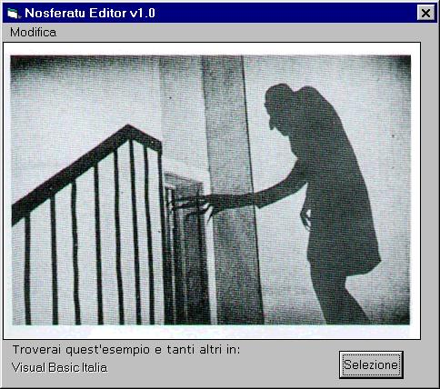



## Nosferatu Editor v1\.0

### Description

This example shows how to edit (cut,paste,copy) a selection of a bitmap using BitBlt function just like Microsoft Photo Editor does. It's really EASY! Take a look to the sample if you don't believe me and don't forget to VOTE FOR ME!

Note: comments are in italian...i hadn't enough time to translate them all. Sorry..(VOTE!)
 
### More Info
 

             |
---                |---
**Submitted On**   |2000-11-21 02:55:36
**By**             |[Andrea Martelli](https://github.com/Planet-Source-Code/PSCIndex/blob/master/ByAuthor/andrea-martelli.md)
**Level**          |Intermediate
**User Rating**    |4.3 (13 globes from 3 users)
**Compatibility**  |VB 6\.0
**Category**       |[Graphics](https://github.com/Planet-Source-Code/PSCIndex/blob/master/ByCategory/graphics__1-46.md)
**World**          |[Visual Basic](https://github.com/Planet-Source-Code/PSCIndex/blob/master/ByWorld/visual-basic.md)
**Archive File**   |[CODE\_UPLOAD1209211262000\.zip](https://github.com/Planet-Source-Code/andrea-martelli-nosferatu-editor-v1-0__1-13133/archive/master.zip)

### API Declarations

Only BitBlt function. Refer to Module.Bas

